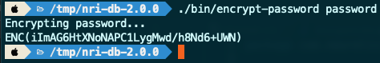
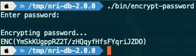

[](https://opensource.newrelic.com/oss-category/#experimental)

# New Relic Infrastructure Database Integration

The New Relic Infrastructure Database Integration is a standalone Java
application that uses JDBC to extract telemetry from a variety of relational
database management systems.

## Compatibility

The following database types are supported.

| Database Vendor | JDBC Driver Class | Driver Packaged? | Provider ID |
| --- | --- | --- | --- |
| IBM AS/400 | `com.ibm.as400.access.AS400JDBCDriver` | N | AS400 |
| IBM Db/2 | `com.ibm.db2.jcc.DB2Driver` | N | DB2 |
| Oracle | `oracle.jdbc.driver.OracleDriver` | N | oracle |
| MSSQL | `com.microsoft.sqlserver.jdbc.SQLServerDriver` | N | MSSQL |
| MySQL | `com.mysql.cj.jdbc.Driver` | N | MySQL |
| Postgres | `org.postgresql.Driver` | Y | Postgres |
| HSQLDB | `org.hsqldb.jdbc.JDBCDriver` | Y | HSQLDB |

## Installation

There are three deployment options for the New Relic Infrastructure Database
Integration (hereafter just `nri-db`).

1. On-host: The Java application is run directly on a host as a native process
1. Docker: The Java application is run inside a Docker container deployed to a container
   service (e.g. AWS ECS) using a [docker-compose file](https://docs.docker.com/compose/compose-file/)
1. Kubernetes: The Java application is run as a deployment in a Kubernetes
   cluster

The following steps are required for _all_ deployment options.

1. Download and extract [the latest release](https://github.com/newrelic-experimental/nri-db/releases)
   from this repository.

   For On-host deployments, if deploying to a host manually, perform this
   steps directly on the host. For Docker or Kubernetes deployments, or if
   deploying on-host using an automation tool such as
   [Ansible](https://www.ansible.com/), perform this step locally to prepare
   the configuration files, images, etc.

1. Setup an [encryption password](#setup-an-encryption-password)
1. [Encrypt](#encrypt-passwords) the database password
1. (Optional) [Encrypt](#encrypt-passwords) the trust store password if
   connecting to databases using SSL

### On-host

1. Setup the [configuration file](#integration-configuration)
1. Setup the [database command file(s)](#database-command-file)
1. Deploy [the latest release](https://github.com/newrelic-experimental/nri-db/releases)
   to the host if not already deployed
1. Copy the configuration file to `config/plugin.json`
1. Copy the database command file(s) to the appropriate directory
1. [Run](#running-the-integration-on-host) the integration

### Docker

1. Setup the [configuration file](#integration-configuration)
1. Setup the [database command file(s)](#database-command-file)
1. Build the Docker image, specifying an appropriate tag for your deployment
   service, the local path to the JDBC driver for your database, and the
   name of the JDBC driver Jar.

   `docker build -t name:tag . --build-arg db_driver_path=/path/to/dbdriver.jar --build-arg db_driver_jar=dbdriver.jar`

   When using a single `nri-db` container to access databases from multiple
   vendors, manual customization of the [`Dockerfile`](./Dockerfile) will be
   necessary in order to add multiple driver JARs to the image and to the
   `CLASSPATH`. See [Using Multiple Databases With The `Dockerfile`](#using-multiple-drivers-with-the-dockerfile)

1. Create a `.env` file in the project root with the following contents

   ```ini
   NRI_DB_NAME_TAG=name:tag
   ```

   where `name:tag` is the tag used to build the image in the previous step

1. Follow the instructions from your cloud provider for deploying Docker
   containers.  For AWS ECS, you can use the
   [docker-compose CLI ECS integration](https://docs.docker.com/cloud/ecs-integration/).

### Kubernetes

Deployment to Kubernetes is done via a [Helm](https://helm.sh/) [chart](./helm).

1. Build a Docker image as outlined [above](#docker)
1. Setup the [Helm values file](#helm-values-file)
1. Install the Helm chart by executing the following command from the project
   directory root

   `helm install -f /path/to/values.yaml nri-db ./helm/nri-db`

## Usage

### Password Encryption

The New Relic Infrastructure Database Integration uses password based encryption
to encrypt passwords in the [configuration file](#integration-configuration).
Password based encryption uses an alphanumeric password to encrypt and decrypt
data.

During setup, the encryption password is used by the included `encrypt-password`
tool to encrypt the passwords for the configuration file.  At runtime, the
encryption password is used to decrypt the passwords prior to executing
operations that require a password.

In both cases, the encryption password can either be specified as an environment
variable or specified in a Java properties file named `.nridbrc` in the
directory from which the integration is launched.

#### Setup an encryption password

Before any passwords can be encrypted, an encryption password must be
established. You can choose your own password or generate one using the
`encrypt-password` tool.

##### Generate a random encryption password

There are two ways to generate a random encryption password. The method you use
depends on whether you plan to specify the encryption password at runtime via an
environment variable of the `.nridbrc` file.

1. To generate an encryption password and create the `.nridbrc` file at the same
   time, simply invoke the `./bin/encrypt-password` command.
2. To generate an encryption password for use as an environment variable, invoke
   the command `./bin/encrypt-password --generate`. A random encryption password
   will be generated and output to the screen. Save the value for later use.

##### Choose your own password

If you plan to specify the encryption password as an environment variable, no
further action is necessary. If you plan to specify the encryption password via
the `.nridbrc` file, create a file named `.nridbrc` within the project root
directory with the following format.

```properties
encryptionPassword=YOUR_ENCRYPTION_PASSWORD_HERE
```

#### Encrypt passwords

The `encrypt-password` tool is used to encrypt passwords for use within the
[configuration file](#integration-configuration). The password to encrypt can be
specified either on the command line or using a password prompt. The specified
password will be encrypted using the encryption password and the resulting
encrypted value will be output to the console.

The encryption password will be taken from either the environment variable named
`NRIDB_ENCRYPTION_PASSWORD` or, if no value exists or the value is empty, from
a file named `.nridbrc` in the current directory. If no such file exists, the
tool will create the file with a random password and exit. You must run it again
to actually encrypt the password.

To encrypt a password by specifying it at the command line, execute the
following command from the project root directory.

```sh
./bin/encrypt-password YOUR_PASSWORD_HERE
```

The screenshot below shows an example of encrypting the password `password`
using the encryption key `12345` by specifying the password as an argument at
the command line.



To encrypt a password using a secure password prompt, execute the
`encrypt-password` tool with no arguments from the project root directory as
follows.

```sh
./bin/encrypt-password
```

The screenshot below shows an example of encrypting the password `password`
using the encryption key `12345` using the secure password prompt.



### Integration Configuration

The New Relic Infrastructure Database Integration configuration file consists of
two main parts: the New Relic connections settings and a list of
"agent instances". The [sample configuration file](./config/plugin.sample.json)
shows an example of all possible settings.

#### Connection settings

The `global` section of the integration configuration file contains the settings
used to connect to New Relic and insert data via the Event API. The section
takes the following format.

```json
{
  "global": {
    "account_id": "insert_your_RPM_account_ID_here",
    "insights_mode": {
      "insights_insert_key": "insert_your_insights_insert_key_here"
    },
    "proxy": {
      "proxy_host": "enter_proxy_host",
      "proxy_port": 8080,
      "proxy_username": "enter_proxy_username",
      "proxy_password": "enter_proxy_password"
    }
  },
  "agents": [
    ...
  ]
}
```

The available settings and their meanings are as follows.

##### Valid connection settings

| Setting | Description |
| --- | --- |
| account_id | A New Relic account ID to which to send telemetry |
| insights_mode.insights_insert_key | A New Relic [insights insert key / license key](https://docs.newrelic.com/docs/apis/intro-apis/new-relic-api-keys/#insights-insert-key) |
| proxy.proxy_host | If a proxy is required to connect to New Relic, the proxy hostname |
| proxy.proxy_port | If a proxy is required to connect to New Relic, the proxy port |
| proxy.proxy_username | If an authenticated proxy is required to connect to New Relic, the proxy username |
| proxy.proxy_password | If an authenticated proxy is required to connect to New Relic, the proxy password |

#### Agent instances

The `agents` section of the integration configuration file contains a list of
"agent instances". Each agent instance is a defined by a configuration
consisting of the connections settings of a database to connect to along with
the path to a [database command file](#database-command-file). The section takes
the following format.

```json
{
  "global": {
    ...
  },
  "agents": [
    {
      "name": "INSTANCE NAME",
      "host": "HOST",
      "port": 12345,
      "username": "DB USER",
      "password": "ENCRYPTED PASSWORD",
      "inputfile": "PATH TO QUERY JSON FILE",
    },
    ...
    {
      "name": "INSTANCE NAME 2",
      "host": "HOST",
      "port": 12345,
      "username": "DB USER",
      "password": "ENCRYPTED PASSWORD",
      "inputfile": "PATH TO QUERY JSON FILE",
      "sslConnection": true,
      "sslEncrypt": true,
      "sslTrustServerCert": true,
      "sslHostnameInCert": "HOSTNAME",
      "sslTrustStoreLocation": "TRUST STORE LOCATION",
      "sslTrustStorePassword": "ENCRYPTED TRUST STORE PASSWORD",
      "static": {
        "foo": "bar",
        "beep": "bop"
      }
    }
  ]
```

The available settings and their meanings are as follows.

##### Valid agent instance settings

| Setting | Description | Type | Required? | Default |
| --- | --- | --- | --- | --- |
| name | A name for the agent instance. This is *not* the database name. It is used in the event data sent to New Relic and can be used to query different database samples via NRQL. | string | Y | n/a |
| host | The hostname of the database to which to connect | string | Y | n/a |
| port | The port of the database to which to connect | integer | Y | n/a |
| username | The username to use to authenticate to the database | string | Y | n/a |
| password | The password to use to authenticate to the database | string | Y | n/a |
| inputfile | The path to the [database command file](#database-command-file) | string | Y | n/a |
| sslConnection | Whether or not to use secure sockets when connecting to the database | boolean | N | false |
| sslEncrypt | MSSQL only - driver uses TLS encryption | boolean | N | false |
| sslTrustServerCert | MSSQL only - whether or not the host's SSL cert is automatically trusted via TLS | boolean | N | false |
| sslHostnameInCert | MSSQL only - The host name to be used to validate the SQL Server TLS/SSL certificate | string | N | '' |
| sslTrustStoreLocation | The path to the [database command file](#database-command-file) | string | Y if sslConnection = true | '' |
| sslTrustStorePassword | The path to the [database command file](#database-command-file) | string | Y if sslConnection = true | '' |
| static | An set of key/value pairs to add to every event for this instance | object | N | null |

### Database Command File

Each agent instance must specify a database command file. A database command
file consists of a list of queries to run. Each query is specified using a
configuration consisting of the query to run along with a name for the query and
the database name and provider. The file takes the following format.

```json
[
  {
    "query" : "select * from pg_stat_activity",
    "name" : "Stat Activity",
    "type" : "metric",
    "database" : "postgres",
    "provider" : "Postgres"
  },
  ...
  {
    "query" : "select * from pg_user",
    "name" : "Archive Files",
    "type" : "metric",
    "database" : "postgres",
    "provider" : "Postgres"
  }
]
```

The available settings and their meanings are as follows.

#### Valid query configuration settings

| Setting | Description | Type | Required? | Default |
| --- | --- | --- | --- | --- |
| name | A name for the query. This is used only in the event data sent to New Relic and can be used to query different query results via NRQL. | string | Y | n/a |
| query | The SQL query to run | string | Y | n/a |
| type | This field should always be set to `metric` ^ | string | Y | n/a |
| database | The name of the database to query | string | Y | n/a |
| provider | The database provider ID (see [Compatibility](#compatibility)) | string | Y | n/a |
| metricType | The type of metric, either `Gauge`, `Delta` or `Rate` ^^ | string | N | Gauge |
| queryOptions | Collection of options used in the query ^^^ | object | N | null |
| eventType | The name of the custom event | string | N | [the database provider ID](#compatibility) |
| parser | Class of custom result parser to load (must be in the class path) | string | N | null |
| parserOptions | JSON to pass to the custom parser for configuration | object | N | null
| deduplicate   | Wether or not to attempt row-level deduplication based on MD5 hash | boolean | N | false |
| uniqueHistorySize | Number of unique row hashes to keep | integer | N | 10000 |
| rowBufferSize | uffer size for deduplication hash | integer | N | 5120 |

^ The `inventory` type is no longer supported as this package no longer
supports "Infrastructure mode".

^^ The `metricType` attribute defines the data type that will be used by the
agent. This is an optional attribute. The default value is "Gauge", which is the
"real" number reported. The other supported values are:

* Gauge: Just the absolute number
* Delta: Number as compared to the previous number
* Rate: Calculated Rate

These values only apply to numeric metrics. All the string/text values are
considered "attribute metrics" and will be saved as string attributes on the
event.

In addition, the following guidelines should be followed.

* If possible, return single numbers in the queries where `Delta` or `Rate` will
  be used
* Provide "readable" names using aliases whenever possible to get better
  attribute names in the custom events, especially when running functions on SQL
  (count(), sum(), avg(), etc)

^^^ The following query options are supported.

| Name | Description |
| --- | --- |
| initialQuery | Query to run at startup time. The goal is to initialize the columns below for use in query that is parameterized. |
| queryParameterColumns | Array of column names returned by **BOTH** the `initialQuery` and the main `query`. The last value returned will be used as the parameter for the next query run. The order of the array items matters. |

The following is an example of a minimal agent instance configuration.

```json
{
  "name" : "Stat Activity",
  "provider" : "Postgres",
  "query" : "select * from pg_stat_activity",
  "type" : "metric",
  "database" : "test"
}
```

The following is an example of a full agent instance configuration.

```json
{
  "name" : "Stat Activity",
  "provider" : "Oracle",
  "query" : "SELECT ID, ErrorMessage FROM MyTable WHERE ID > ? ORDER BY ID ASC",
  "type" : "metric",
  "database" : "test",
  "metricType": "Gauge",
  "queryOptions": {
    "initialQuery": "select max(id) ID from MyTable",
    "queryParameterColumns": [
      "ID"
    ]
  },
  "parser": "my.custom.result.parser.class",
  "parserOptions": {
    "ThisJSON": "Passed to the Parser"
  },
  "deduplicate": true,
  "uniqueHistorySize": 5000,
  "rowBufferSize": 10000
}
```

### Helm Values File

For Kubernetes deployments, a Helm chart is provided to install a deployment
and the supporting Kubernetes resources required to run nri-db in a cluster.
As with most Helm charts, a Helm Values file can be provided to specify the
Helm values used in the chart. The default set of values are provided in the
[values.yaml file](./helm/values.yaml).

The settings underneath the line `# Kubernetes resource settings` are values
that can be used to customize various aspects of the actual Kubernetes
resources created when the chart is installed. These are not documented here
and in general require a knowledge of Kubernetes to customize.

The section underneath the line `# nri-db application settings` are the values
used to customize the `nri-db` application itself. These settings correspond
to those specified in the
[integration configuration](#integration-configuration) and the
[database command file](#database-command-file) and to the
[encryption password](#setup-an-encryption-password). Refer to the referenced
sections when customizing the values file.

The following is an example of a values file with customized settings for the
`nri-db` application settings.

```yaml
# ------------------------------------------------------------------------------
# nri-db application settings

encryptionPassword: "12345"
pluginConfig:
  accountId: "1"
  insertKey: "NRAK-XXXXXXXXXXXX"
  agents:
  - name: INSTANCE NAME
    host: HOST
    port: 12345
    username: DB USER
    password: ENCRYPTED PASSWORD
    inputfile: inputs/input1.json
  - name: INSTANCE NAME 2
    host: HOST
    port: 12345
    username: DB USER
    password: ENCRYPTED PASSWORD
    inputfile: inputs/input2.json
    sslConnection: true
    sslTrustStoreLocation: TRUST STORE LOCATION
    sslTrustStorePassword: ENCRYPTED TRUST STORE PASSWORD
    static:
      foo: bar
      beep: bop
  inputs:
  - name: input1.json
    queries:
    - name: Stat Activity
      provider: Postgres
      query: select * from pg_stat_activity
      type: metric
      database: test
  - name: input2.json
    queries:
    - name: Stat Activity
      provider: Oracle
      query: 'SELECT ID, ErrorMessage FROM MyTable WHERE ID > ? ORDER BY ID ASC'
      type: metric
      database: test
      metricType: Gauge
      queryOptions:
        initialQuery: select max(id) ID from MyTable
        queryParameterColumns:
          - ID
      parser: my.custom.result.parser.class
      parserOptions:
        ThisJSON: Passed to the Parser
      deduplicate: true
      uniqueHistorySize: 5000
      rowBufferSize: 10000
```

### Using Multiple Drivers With The `Dockerfile`

If databases from multiple database vendors need to be accessed from within a
single Docker container, manual customization of the
[`Dockerfile`](./Dockerfile) is necessary.

For each database vendor, the appropriate driver must be added to the
`/app/nri-db/lib` directory and the path to the driver JAR file must be appended
to the `CLASSPATH` environment variable. The following examples shows how to
create an image using 2 different database drivers.

```Dockerfile
FROM openjdk:11

# No need for these since we are manually modifying anyway
#ARG db_driver_path
#ARG db_driver_jar

RUN mkdir /app

ADD . /app/nri-db
ADD ./.nridbrc /root
ADD /path/to/dbdriver1.jar /app/nri-db/lib
ADD /path/to/a/different/dbdriver2.jar /app/nri-db/lib

RUN chmod 0400 /root/.nridbrc

ENV CLASSPATH=/app/nri-db/lib/dbdriver1.jar:/app/nri-db/lib/dbdriver2.jar

WORKDIR /app/nri-db

CMD ["./bin/nri-db"]
```

### Running the Integration On Host

For On-host deployments, the `nri-db` application process must be running at
all times. The easiest way to ensure this on Linux based distributions is to
install one of the operating system [startup services](#linux-startup-services).
On Windows, the best option is probably to use Docker. Another option is to use
a tool like [NSSM](https://nssm.cc/) to create a Windows service to execute the
service [using a shell script](#windows)

#### Linux Startup Services

##### Systemd

The file [`install/nri-db.service`](./install/nri-db.service) contains a
[Systemd](https://en.wikipedia.org/wiki/Systemd) service unit definition for
running the `nri-db` application process. To install this service unit, perform
the following steps.

1. Edit the `install/nri-db.service` file as follows

   1. Update the value for the `WorkingDirectory` property from `@installdir@`
      to the absolute path to the  `nri-db` installation directory. For example,

      `WorkingDirectory=/usr/local/software/nri-db`

   1. Update the value for the `CLASSPATH` in the `Environment` property from
      `@dbdriverpath@` to the absolute path of the database driver. For example,

      `Environment="JAVA_OPTS=-Xmx512m CLASSPATH=/usr/local/db2/db2jcc.jar"`

   1. Optionally update the value for the `JAVA_OPTS` in the `Environment`
      property with any additional Java options.

1. Move the updated `install/nri-db.service` file into `/etc/systemd/system`
   For example,

   `sudo mv ./install/nri-db.service /etc/systemd/system`

1. Run the following commands

   ```sh
   sudo systemctl daemon-reload
   sudo systemctl start nri-db.service
   sudo systemctl enable nri-db.service
   ```

##### Upstart

The file [`install/nri-db.conf`](./install/nri-db.conf) contains an
[Upstart](http://upstart.ubuntu.com/cookbook/) job configuration file for
running the `nri-db` application process. To install this job configuration,
perform the following steps.

1. Edit the `install/nri-db.conf` file as follows:

   1. Update the value for the `chdir` stanza from `@installdir@`
      to the absolute path to the  `nri-db` installation directory. For example,

      `chdir /usr/local/software/nri-db`

   1. Update the value for the `CLASSPATH` in the first `env` stanza from
      `@dbdriverpath@` to the absolute path of the database driver. For example,

      `env CLASSPATH=/usr/local/db2/db2jcc.jar`

   1. Optionally update the value for the `JAVA_OPTS` in the second `env` stanza
      property with any additional Java options.

1. Move the updated `install/nri-db.conf` file into `/etc/init`
   For example,

   `sudo mv ./install/nri-db.conf /etc/init`

1. Run the following commands

   ```sh
   sudo initctl reload-configuration
   sudo initctl start nri-db
   ```

#### Manual Execution

The integration can also be run manually with a few simple commands.

#### Linux

To run the integration on Linux, execute the following commands.

```sh
export CLASSPATH=/path/to/dbdriver.jar:$CLASSPATH
cd /path/to/nri-db-installdir
./bin/nri-db
```

Alternately copy the following shell script into a file and make the file
executable. Then the integration can be run at anytime with a single command.

```sh
#!/bin/bash
# Run nri-db

export CLASSPATH=/path/to/dbdriver.jar:$CLASSPATH

cd /path/to/nri-db-installdir

./bin/nri-db
```

#### Windows

To run the integration on Microsoft Windows, execute the following commands.

```bat
set CLASSPATH=C:\path\to\dbdriver.jar;%CLASSPATH%
cd C:\path\to\nri-db-installdir
.\bin\nri-db
```

Alternately copy the following shell script into a file and make the file
executable. Then the integration can be run at anytime with a single command.

```bat
@rem Run nri-db

set CLASSPATH=C:\path\to\dbdriver.jar;%CLASSPATH%

cd C:\path\to\nri-db-installdir

.\bin\nri-db
```

## Building

This project uses [gradle](https://gradle.org/) with a generated
[gradle wrapper](./gradlew). To run a build, execute the following command
from the root of the project.

```sh
./gradlew clean build
```

## Testing

This project uses [JUnit 4](https://junit.org/junit4/) for testing. To run all
tests, execute the following command from the root of the project.

```sh
./gradlew cleanTest test
```

### Integration Testing

The following sections document how to create local Docker instances running
different databases that can be used for integration testing.

#### MySQL

```sh
docker run --rm --name mysql -e MYSQL_ROOT_PASSWORD=root -d -p 3306:3306 mysql:latest
```

#### Postgres

```sh
docker run --name postgres -e POSTGRES_PASSWORD=root -d --rm -p 5432:5432 postgres
```

#### DB/2

```sh
docker run -itd --name db2 --privileged=true -p 50000:50000 -e LICENSE=accept -e DB2INST1_PASSWORD=root -e DBNAME=testdb ibmcom/db2
```

## Troubleshooting

### Logging

This project uses [Java Util Logging](https://docs.oracle.com/javase/8/docs/api/index.html?java/util/logging/package-summary.html)
for generating logs. To generate debug logs, uncomment the following line in
the file [logging.properties](./config/logging.properties) and restart the
integration.

```properties
...
#com.newrelic.infra.db.level = FINEST
```

Logs will be output to the console and to the [logs](./logs) directory.

## Support

New Relic has open-sourced this project. This project is provided AS-IS WITHOUT
WARRANTY OR DEDICATED SUPPORT. Issues and contributions should be reported to
the project here on GitHub.

We encourage you to bring your experiences and questions to the
[Explorers Hub](https://discuss.newrelic.com) where our community members
collaborate on solutions and new ideas.

## Contributing

We encourage your contributions to improve the New Relic Infrastructure Database
Integration! Keep in mind when you submit your pull request, you'll need to sign
the CLA via the click-through using CLA-Assistant. You only have to sign the CLA
one time per project.

If you have any questions, or to execute our corporate CLA, required if your
contribution is on behalf of a company,  please drop us an email at
opensource@newrelic.com.

## License

The New Relic Infrastructure Database Integration is licensed under the
[Apache 2.0](http://apache.org/licenses/LICENSE-2.0.txt) License.

The New Relic Infrastructure Database Integration also uses source code from
third-party libraries. You can find full details on which libraries are used
and the terms under which they are licensed in the third-party notices document.
